# FairFlow Guardian

FairFlow Guardian is an explainable AI trading safety layer for the BGA AI Trading & Strategy Track. It does not try to win a pure PnL contest. It helps retail users understand whether a trade should be executed, reduced, or rejected by combining market regime analysis, manipulation-risk detection, liquidation stress testing, and a tamper-evident audit hash.

For a concise judge-facing overview, see [PROJECT_DESCRIPTION.md](PROJECT_DESCRIPTION.md).

For the full system architecture, see [docs/solution-diagram.md](docs/solution-diagram.md).

## Final submission packet

- Judge-facing PPT: `output/presentation/fairflow_2_minute_video_deck.pptx`
- Two-minute script: `output/presentation/fairflow_2_minute_video_script.txt`
- Complete walkthrough PDF: `output/pdf/fairflow_guardian_complete_walkthrough.pdf`
- Visual QA sheet: `output/presentation/fairflow_2min_video_contact_sheet.png`
- Submission notes: `SUBMISSION.md`
- Final smoke check: `pnpm run smoke:final`

Curated upload-ready copies live in `submission/`, including a `submission/video/` folder for the final recorded demo.

## What makes it different

- Multi-agent review: strategy suggestions are challenged by a separate risk guardian and manipulation sentinel.
- Agentic AI committee: ML regime classification, anomaly detection, uncertainty forecasting, execution planning, backtesting, memory calibration, and audit narration.
- Judge Mode Brief: turns each audit into a rubric-aligned 3-minute demo script with evidence links, safety boundaries, and likely judge questions.
- Hackathon Readiness Runbook: maps each audit to judging criteria, proof URLs, strongest claims, limitations, and a step-by-step demo path.
- Submission Kit: packages the 2-minute video path, generated artifacts, final checklist, and copyable proof block for judges.
- Competition Runway: puts the finalist demo path, readiness score, evidence pack, route proof, and calm/no-trade controls at the top of the dashboard.
- Model & Data Provenance Card: discloses data sources, AI/risk components, limitations, validation artifacts, and reproducibility steps for each audit.
- Agent Mission Control: a guarded mission loop that plans specialist tasks, critiques the result, exposes risks, and queues only permitted next actions.
- Agent Watchlist Scanner: ranks an editable crypto universe by fairness, liquidity, anomaly risk, market-depth tier, and audited execution status.
- Fairness Passport: a retail-protection score for information parity, execution parity, manipulation exposure, risk protection, and auditability.
- Audited decision trace: every report shows the exact path from market data intake to final trade/no-trade outcome.
- Scenario Lab: compares calm, volatile, manipulated, and optional live market states side by side.
- Real-time price chart: streams 5-minute OHLCV candles from the same live/fallback source used by the agents.
- Paper portfolio: tracks simulated executions, open positions, PnL, exposure, and blocked-order history.
- Risk sizing sandbox: recalculates notional, margin, and max loss from a user equity/risk budget.
- Policy Studio: lets users tune retail guardrails and see which policy checks pass, watch, or block.
- Policy Stress Lab: replays each audit through access-first, balanced, and strict guardrail presets to expose fragile approvals and protective no-trade consensus.
- Counterfactual Fairness Lab: explains which guardrail would need real market improvement before a future audit could be safer, and which gates cannot be bypassed.
- Fair Execution Router: ranks paper-only market, post-only, TWAP, maker-ladder, and hold/re-audit routes by slippage, leakage, manipulation exposure, and retail route fairness.
- Market Integrity Red Team: replays liquidity withdrawal, spoofed imbalance, volatility cascade, funding squeeze, and reference-price gap probes against each audit.
- Audit Evidence Pack: bundles the decision, receipt, cohorts, provenance, execution router, policy stress, red-team report, judge brief, and anchor proof into one copyable verifier artifact.
- Retail Fairness Receipt: produces a copyable, machine-verifiable receipt for each audit with hidden costs, agent concerns, protections, and verification steps.
- Retail Cohort Simulator: checks whether the same audited strategy remains affordable for micro, starter, everyday, and active retail accounts after sizing, hidden costs, and margin use.
- Impact Ledger: summarizes recent audits into BGA-facing evidence such as blocked unsafe trades, manipulation alerts, hidden-cost drag avoided, cohort inclusion, and recurring fairness issues.
- On-chain Audit Anchor Kit: converts any audit hash into contract-ready `FairFlowAudit.anchorDecision` arguments, metadata, payload hash, and verification steps.
- Audit Vault: keeps recent in-memory decision reports available for review during a demo session.
- "No trade" is a first-class outcome when the market is unsafe.
- Bybit V5 public market data integration with deterministic fallback scenarios for reliable demos.
- Transparent scoring for spread, book imbalance, funding crowding, volatility, stress loss, and liquidity.
- Verifiable decision reports hashed with SHA-256.
- Persistent SQLite audit ledger so generated reports remain reviewable after backend restarts.
- Optional Solidity contract for anchoring report hashes on-chain.

## Demo flow

1. Select `BTCUSDT` and the `Calm` scenario.
2. FairFlow should approve only a small, risk-capped paper trade.
3. Use Competition Runway to show the finalist thesis, readiness score, route proof, evidence pack, and proof-copy action.
4. Open Judge Mode Brief and use the generated opening line plus rubric cards to frame the demo.
5. Open Hackathon Readiness Runbook to follow the detailed judging-criteria path, strongest claims, limitations, and proof URLs.
6. Open Submission Kit to show the exact 2-minute video path, generated artifacts, final checklist, and copyable proof block.
7. Open Evidence Pack and copy the full proof bundle for the current audit.
8. Open Model & Data Provenance to show what data and AI components produced the report, including limitations.
9. Use the Impact Ledger to show cumulative market-health evidence across generated audits.
10. Open the Fairness Passport and explain whether the market is fair enough for a retail participant.
11. Generate the Retail Fairness Receipt and show the BGA alignment score, agent concerns, protections, and verification URL.
12. Use the Retail Cohort Simulator to show whether the same strategy is inclusive, limited, or exclusionary for different account sizes.
13. Open the On-chain Audit Anchor Kit and show the contract-ready call, metadata hash, and verification steps.
14. Open the Decision trace and explain how raw data becomes a final audited outcome.
15. Use the Active Agents panel to show which agents are passing, watching, or blocking.
16. Run the Agent Watchlist Scanner across BTC, ETH, SOL, BNB, XRP, LINK, ADA, and DOGE, then open the safest ranked market.
17. Open Agent Mission Control and run a mission to show the planner, specialist tasks, risk register, and action queue.
18. Open Policy Studio and tighten the guardrails to show how user policy can downgrade or block a trade.
19. Open Policy Stress Lab to show whether access-first, balanced, and strict policies agree or expose fragile approval.
20. Open Counterfactual Fairness Lab to show what must actually improve before any future audit could unlock.
21. Open Fair Execution Router to show how the same audit controls route choice and locks every trading route when the core gate is closed.
22. Open Market Integrity Red Team to show which manipulation-style probes trigger kill switches before retail users are routed.
23. Click permitted actions such as scenario comparison, sizing, or paper execution; blocked actions stay visibly locked.
24. Switch to `Volatile` or `Manipulated`.
25. The system should reject the trade and explain the exact risk checks that failed.
26. Copy the judge pitch, submission kit, runbook, receipt JSON, evidence pack, audit hash, anchor call, or metadata proof.

## Architecture

```mermaid
flowchart LR
    A["Next.js App Router dashboard"] --> B["Typed API client"]
    B --> C["Next /api proxy"]
    C --> D["FastAPI service"]
    D --> E["Bybit public API or fallback scenario"]
    E --> F["Market metrics"]
    F --> G["Deterministic trading agents"]
    G --> H["AI Committee: ML regime, anomaly, forecast, backtest, planner"]
    H --> I["Judge Mode Brief"]
    I --> J["Hackathon Readiness Runbook"]
    J --> K["Submission Kit"]
    K --> L["Competition Runway"]
    L --> M["Model & Data Provenance"]
    M --> N["Fairness Passport"]
    N --> O["Fair Execution Gate"]
    O --> P["Policy Studio + Stress Lab"]
    P --> Q["Counterfactual Fairness Lab"]
    Q --> R["Fair Execution Router"]
    R --> S["Market Integrity Red Team"]
    S --> T["Audit Evidence Pack"]
    T --> U["Retail Fairness Receipt"]
    U --> V["Retail Cohort Simulator"]
    V --> W["Impact Ledger"]
    W --> X["On-chain Audit Anchor Kit"]
    X --> Y["Agent Watchlist Scanner"]
    Y --> Z["Agent Mission Control"]
    Z --> AA["Permitted Action Queue"]
    AA --> AB["Decision Trace + SHA-256 Audit Hash"]
    AB --> AC["Optional Solidity Anchor"]
```



## Software stack

- `Next.js` App Router frontend on `http://localhost:5174`
- `FastAPI` backend service on `http://localhost:8000`
- Typed frontend API boundary in `lib/fairflow-api.ts`
- Python market/agent engine in `fairflow_api/`
- Bybit V5 public market data with deterministic fallbacks
- Solidity audit anchor in `contracts/FairFlowAudit.sol`
- One-command local orchestration with `pnpm run dev:all`

## AI committee agents

- `ML Market Regime Classifier`: online nearest-centroid classifier trained from the current rolling candle window.
- `ML Manipulation Analyst`: robust anomaly detector for volatility, wick, volume, spread, impact, funding, and book imbalance.
- `Uncertainty Forecast Agent`: 30-minute move distribution and stop-hit probability model.
- `Execution Planner Agent`: creates a capped route only after approval; otherwise locks execution.
- `Backtest Agent`: runs a rolling RSI + momentum strategy with volatility rejection.
- `Memory Calibration Agent`: tracks session decisions and avoided trades for calibration context.
- `Audit Narrator Agent`: converts the committee debate into plain-English reasoning.

## Judge Mode Brief

Judge Mode converts the current audit into a three-minute presentation path. It includes:

- one-sentence pitch
- opening line
- rubric cards for BGA ethos, technical depth, risk management, and transparency
- evidence-backed demo steps
- safety boundaries
- likely judge questions
- proof links to audit, receipt, cohort, anchor, and impact endpoints

This keeps the first demo minute focused on why FairFlow improves market fairness instead of forcing judges to infer the story from dense trading telemetry.

## Hackathon Readiness Runbook

The readiness runbook is the final handoff surface. For each audit it generates:

- a readiness verdict and score
- rubric mapping for BGA ethos, technical depth, risk management, and transparency
- proof URLs for each claim
- a 12-step demo sequence with UI action, expected result, underlying mechanism, and judge script
- strongest claims and honest limitations
- a copyable 30-second pitch

This helps teams present the project coherently and helps reviewers evaluate it without guessing how the pieces fit together.

## Submission Kit

The submission kit is the final competition handoff layer. For each audit it packages:

- a six-segment, 120-second video path
- dashboard actions for each segment
- proof URLs for the current audit
- the generated walkthrough PDF, 2-minute video deck, narration script, evidence endpoint, and optional anchor payload
- a final checklist covering BGA ethos, technical depth, risk controls, no-trade framing, submission artifacts, and disclosed limits
- a copyable block for the hackathon submission form or video description

The generated video assets live under `output/presentation/`, and the complete walkthrough PDF lives under `output/pdf/`.

## Model & Data Provenance

Each audit includes a model card that separates:

- live public Bybit data from deterministic fallback scenarios
- derived market metrics from raw exchange fields
- lightweight ML signals from deterministic guardrails
- risk models from execution gates
- prototype limitations from validated behavior

The card also lists validation artifacts and reproducibility steps. This makes the AI stack easier to defend without overstating it as a production trading model.

## Agent Mission Control

Mission Control turns a decision report into a guarded agentic workflow:

- `Data Scout` verifies the public market source and current scenario.
- `Regime Analyst` checks the ML market regime.
- `Manipulation Sentinel` searches for anomaly and trap conditions.
- `Risk Allocator` reviews leverage, size, stop distance, and stress loss.
- `Fairness Auditor` enforces the Fairness Passport.
- `Execution Operator` prepares only actions allowed by the audited gate.
- `Route Steward` checks the Fair Execution Router before any guarded paper route can proceed.
- `Memory Curator` checks the paper book, audit vault, and calibration context.

The mission action queue can refresh market data, compare scenarios, calculate risk sizing, paper execute, hold, review the audit, or reset the paper book. Live execution is intentionally not implemented; the highest autonomy level is guarded paper execution.

## Agent Watchlist Scanner

The scanner runs the audited agent stack across a short list of symbols, ranks the results, and exposes the safest candidate. Each ranked row includes:

- fairness score
- liquidity score
- anomaly score
- transparent market-depth adjustment
- execution-gate status
- final action
- audit hash
- plain-English rank reason

This turns FairFlow from a single-symbol explainer into a practical agentic search tool for safer market selection.

For focus, the prototype keeps individual stocks out of the tradable universe. A later version could add stock or macro data as context signals, but live stock execution would require a separate data provider, market-hours model, and compliance surface.

## Policy Studio

Policy Studio evaluates an existing audit hash against user-controlled retail guardrails:

- minimum fairness score
- maximum hidden-cost bps
- maximum anomaly score
- minimum liquidity score
- maximum leverage
- maximum stop-hit probability

The result is a separate policy verdict: `compliant`, `needs_review`, or `blocked`. Policy Studio cannot override the core FairFlow execution gate; it can only add more conservative user-level protections.

## Policy Stress Lab

Policy Stress Lab replays an existing audit through three preset governance stances:

- `Access-first retail review`: inclusive thresholds that still respect the core execution gate.
- `Balanced BGA guardian`: the default FairFlow guardrail policy.
- `Strict institutional controls`: conservative limits for fairness, cost, anomaly risk, liquidity, leverage, and stop-hit probability.

The report produces a resilience verdict, stability score, fragile checks, and judge takeaway. This helps prove that FairFlow is not tuned for a single hand-picked threshold and that no-trade can be a successful protective consensus.

## Counterfactual Fairness Lab

Counterfactual Fairness Lab explains the difference between a real market improvement and a bypass attempt. For each audit it checks:

- fairness score floor
- hidden-cost ceiling
- anomaly-risk ceiling
- liquidity floor
- leverage ceiling
- stop-hit probability ceiling
- the core FairFlow execution gate

The report labels each lever as already clear, improvement needed, or non-bypassable. Locked and no-trade audits require a fresh audit after actual market conditions improve; the current audit cannot be locally unlocked.

## Fair Execution Router

Fair Execution Router answers the post-audit question: if a strategy is allowed, how should a retail-safe paper route be handled? It compares:

- immediate guarded market route
- post-only limit route
- TWAP micro-slices
- maker ladder
- hold and re-audit

Each route is scored for expected slippage, fill probability, information leakage, manipulation exposure, maximum notional, and retail route fairness. If the Guardian gate, Fairness Passport, or no-trade action is locked, all trading routes stay locked and the only recommended route is hold/re-audit.

## Market Integrity Red Team

The red-team report applies deterministic adversarial probes to the current audit:

- liquidity withdrawal
- spoofed order-book imbalance
- volatility stop cascade
- funding squeeze
- reference-price gap

Each probe reports stressed hidden cost, anomaly score, liquidity score, stop-hit probability, first triggered safeguard, retail harm, and mitigation. The output is designed to show that FairFlow can approve calm conditions while still documenting how it would stop when market integrity worsens.

## Audit Evidence Pack

The evidence pack is a copyable verifier artifact for a single audit hash. It includes:

- the original `GuardianDecision`
- fairness receipt and retail cohort simulator output
- on-chain anchor proof
- judge brief
- model and data provenance card
- fair execution router report
- counterfactual fairness report
- policy stress report
- market integrity red-team report
- core claims, key metrics, evidence URLs, verifier notes, and limitations

This gives reviewers one endpoint to inspect before trusting the dashboard narrative.

## Decision trace

Each API response includes a seven-step trace:

1. Market data intake
2. Feature engineering
3. Strategy proposal
4. Deterministic agent gate
5. AI committee debate
6. Risk and stress decision
7. Final audited outcome

This is the core explainability feature: judges and users can see which stage approved, watched, or blocked the setup before looking at the detailed agent cards.

## Fairness Passport

Each report also includes a retail-focused fairness score. It checks:

- `Information parity`: whether the data source is public, replayable, and inspectable.
- `Execution parity`: spread, order-book impact, top depth, and imbalance.
- `Manipulation exposure`: whether retail users may be trading into a trap.
- `Retail risk protection`: stop loss, leverage, sizing, and forecasted stop-hit risk.
- `Auditability`: whether the reasoning can be verified after the market moves.

The passport produces one of three verdicts: `fair_to_execute`, `wait_for_parity`, or `unfair_to_retail`.

## Retail Fairness Receipt

Each audit hash can generate a receipt designed for transparent handoff to a retail user, judge, or future on-chain anchor. The receipt includes:

- BGA alignment score based on fairness, liquidity, anomaly safety, transparency, and gate discipline.
- Hidden-cost, liquidity, anomaly, execution-gate, and audit-hash metrics.
- Agent concerns and non-passing fairness checks.
- Retail protections and verification steps.
- A machine-readable URL back to the full audit report.

The receipt is intentionally separate from execution. It can explain why a paper route is allowed, but it can also prove why the safest outcome is to block or observe.

## Retail Cohort Simulator

The simulator asks whether a strategy that looks safe in aggregate is still fair for different retail account sizes. It evaluates four default profiles:

- `Micro retail`: 250 USDT account, 0.5% risk budget, 12% max notional.
- `Starter retail`: 1,000 USDT account, 0.75% risk budget, 18% max notional.
- `Everyday retail`: 5,000 USDT account, 1% risk budget, 25% max notional.
- `Active retail`: 25,000 USDT account, 1% risk budget, 30% max notional.

For each cohort, FairFlow calculates recommended notional, margin use, max loss, hidden-cost burden, and a friction score. The report verdict is `inclusive`, `limited`, or `exclusionary`. If the core audit is blocked, all cohorts remain blocked; the simulator never weakens the execution gate.

## Impact Ledger

The Impact Ledger turns the persistent audit history into a judge-facing evidence layer. It reports:

- total audits, approvals, observations, blocks, and no-trade outcomes
- manipulation alerts caught by the agent stack
- estimated hidden-cost drag avoided by not routing blocked setups
- cohort inclusion outcomes across recent audits
- recurring fairness and agent issues with examples
- a BGA ethos score combining fairness, hidden-cost control, cohort inclusion, unsafe-market gate discipline, and transparency

This is useful in a hackathon demo because the project can show cumulative social value, not just a single lucky decision.

## On-chain Audit Anchor Kit

The anchor kit makes the Solidity integration visible without pretending to submit live transactions. For any audit hash, it prepares:

- `bytes32` decision hash
- `symbol`
- `action`
- `metadataURI`
- contract call preview for `FairFlowAudit.anchorDecision(bytes32,string,string,string)`
- canonical metadata payload hash
- safety notes and verification steps

Anchoring is useful for approved and blocked reports. A blocked `NO_TRADE` anchor proves FairFlow refused unsafe execution before later outcomes were known.

## Run locally

Install dependencies:

```bash
python3 -m venv .venv
source .venv/bin/activate
pip install -r requirements.txt
pnpm install
```

If you prefer npm, `npm install` and `npm run dev` also work.

Start the backend:

```bash
uvicorn fairflow_api.main:app --reload --host 0.0.0.0 --port 8000
```

Start the dashboard in another terminal:

```bash
pnpm run dev
```

Open `http://localhost:5174`.

Or start the complete interactive app with one command:

```bash
pnpm run dev:all
```

This runs FastAPI on `8000` and Next.js on `5174`. The Next app proxies `/api/*` to the backend through `next.config.mjs`, so the browser talks to one origin during local development.

Environment settings live in `.env` and can be copied from `.env.example`:

```bash
cp .env.example .env
```

Useful commands:

```bash
pnpm run build
pnpm run test:api
pnpm run dev:api
pnpm run smoke:final
```

Generate the complete hackathon walkthrough PDF:

```bash
python scripts/build_walkthrough_pdf.py
```

The script collects fresh FastAPI responses through the app itself, writes a JSON evidence snapshot to `tmp/pdfs/walkthrough_payload.json`, and renders the judge-facing walkthrough to `output/pdf/fairflow_guardian_complete_walkthrough.pdf`.

## Project layout

- `app/`: Next.js App Router pages and global styles.
- `components/`: interactive dashboard UI.
- `lib/fairflow-api.ts`: typed frontend API client.
- `fairflow_api/`: FastAPI service, Bybit adapter, agent engine, and Pydantic models.
- `fairflow_api/audit_store.py`: SQLite-backed audit ledger for durable decision reports.
- `tests/`: backend behavior tests.
- `scripts/`: local tooling, including the PDF demo generator and full-stack dev supervisor.

## API endpoints

- `GET /api/health`
- `GET /api/analysis?symbol=BTCUSDT&category=linear&scenario=live`
- `GET /api/analysis?symbol=BTCUSDT&category=linear&scenario=calm`
- `GET /api/analysis?symbol=BTCUSDT&category=linear&scenario=volatile`
- `GET /api/analysis?symbol=BTCUSDT&category=linear&scenario=manipulated`
- `GET /api/compare?symbol=BTCUSDT&category=linear&include_live=false`
- `GET /api/market/series?symbol=BTCUSDT&category=linear&scenario=live`
- `GET /api/impact?limit=50`
- `GET /api/watchlist?symbols=BTCUSDT,ETHUSDT,SOLUSDT,BNBUSDT,XRPUSDT,LINKUSDT,ADAUSDT,DOGEUSDT&category=linear&scenario=calm`
- `GET /api/portfolio?scenario=calm`
- `POST /api/portfolio/reset`
- `POST /api/risk/size`
- `POST /api/policy/evaluate`
- `GET /api/agents/mission?symbol=BTCUSDT&category=linear&scenario=calm`
- `GET /api/agents/mission?audit_hash=generated-decision-hash`
- `GET /api/agents/missions`
- `POST /api/orders/simulate`
- `GET /api/audits`
- `GET /api/audits/{audit_hash}`
- `GET /api/audits/{audit_hash}/receipt`
- `GET /api/audits/{audit_hash}/retail-cohorts`
- `GET /api/audits/{audit_hash}/anchor-proof`
- `GET /api/audits/{audit_hash}/judge-brief`
- `GET /api/audits/{audit_hash}/hackathon-readiness`
- `GET /api/audits/{audit_hash}/submission-kit`
- `GET /api/audits/{audit_hash}/model-provenance`
- `GET /api/audits/{audit_hash}/execution-router`
- `GET /api/audits/{audit_hash}/policy-stress`
- `GET /api/audits/{audit_hash}/counterfactuals`
- `GET /api/audits/{audit_hash}/red-team`
- `GET /api/audits/{audit_hash}/evidence-pack`

Example risk sizing payload:

```json
{
  "audit_hash": "generated-decision-hash",
  "account_equity_usdt": 10000,
  "risk_budget_pct": 1,
  "max_notional_pct": 25
}
```

## Bybit API usage

The live mode uses Bybit V5 public endpoints:

- `/v5/market/kline`
- `/v5/market/orderbook`
- `/v5/market/tickers`
- `/v5/market/open-interest`

No API keys are required for public market data. If Bybit is unreachable, the backend falls back to a deterministic scenario so the demo remains stable.

## On-chain audit

The contract in `contracts/FairFlowAudit.sol` stores a decision hash, symbol, final action, timestamp, and metadata URI. This creates a lightweight proof that the decision report existed before later market outcomes were known.

The dashboard's On-chain Audit Anchor Kit prepares the exact contract arguments and canonical metadata hash for this contract. It does not submit transactions or handle private keys; it keeps anchoring as a verifiable handoff step.

## Persistent audit ledger

The backend writes each generated `GuardianDecision` to `data/fairflow_audits.sqlite3` and keeps a fast in-memory cache for the current process. Audit lookup, paper execution, risk sizing, policy evaluation, and mission runs can all recover an audit from SQLite if the cache is empty.

The local database is ignored by git. Set `FAIRFLOW_AUDIT_DB=/path/to/audits.sqlite3` to choose a different ledger location.

## Safety notes

FairFlow Guardian is a hackathon prototype and educational tool. It uses paper execution only. It is not financial advice and should not be used for live trading without independent review, exchange authentication hardening, extensive backtesting, rate-limit handling, and legal/compliance checks.
