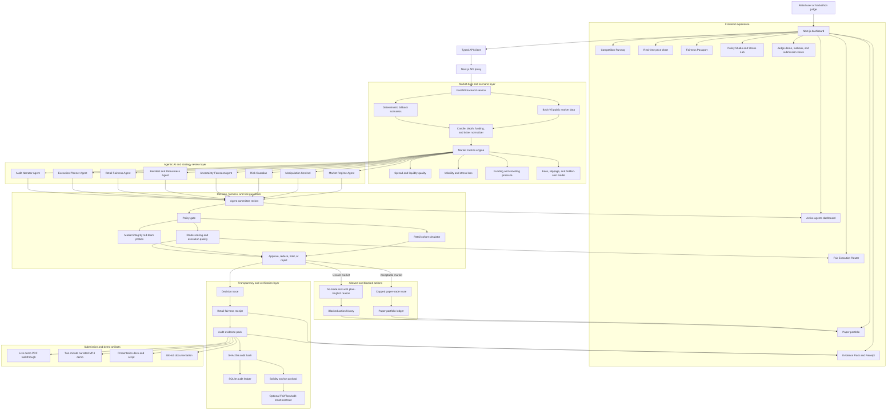

# FairFlow Guardian Solution Diagram

This diagram shows the full FairFlow Guardian solution: the judge-facing dashboard, data path, backend services, agentic review layer, risk controls, audit artifacts, and optional on-chain verification.

## How to Explain the Diagram

FairFlow Guardian starts with a user or judge interacting with the Next.js dashboard. The dashboard is not just a visual shell; it exposes the main product workflow: live market context, agent status, fairness checks, policy controls, paper portfolio, evidence pack, and demo materials.

The frontend calls a typed API client, which passes requests through a Next.js API proxy into the FastAPI backend. The backend pulls public market data from Bybit when available and falls back to deterministic scenarios when live data is unavailable or when a judge needs a reliable calm, volatile, or manipulated market example.

The backend normalizes raw market data into trading metrics such as spread, liquidity quality, volatility, funding pressure, stress loss, and hidden execution costs. Those metrics feed a committee of specialist agents. Each agent has a defined job: classify the regime, detect manipulation, review risk, forecast uncertainty, test strategy robustness, check retail fairness, plan execution, or explain the audit.

The agent outputs are passed through policy and fairness guardrails. This layer decides whether the trade should be approved, reduced, held, or rejected. If the market is unsafe, FairFlow Guardian locks execution and explains the reason. If conditions are acceptable, it only permits a capped paper-trade route.

Every decision creates a transparent audit trail. The system generates a decision trace, retail fairness receipt, evidence pack, SHA-256 hash, persistent ledger entry, and optional Solidity anchor payload. This makes the decision explainable to the user and verifiable for judges.

The final outputs are the dashboard, PDF walkthrough, narrated MP4 demo, presentation deck, and GitHub documentation. Together, they show the hackathon thesis: AI trading systems should be safer, more transparent, and more fair, not merely more aggressive.

## Core Design Principle

FairFlow Guardian treats **no trade** as a valid protective outcome. A blocked trade is not a failed demo; it is proof that the system can prioritize retail safety, transparency, and market integrity over speculation.
